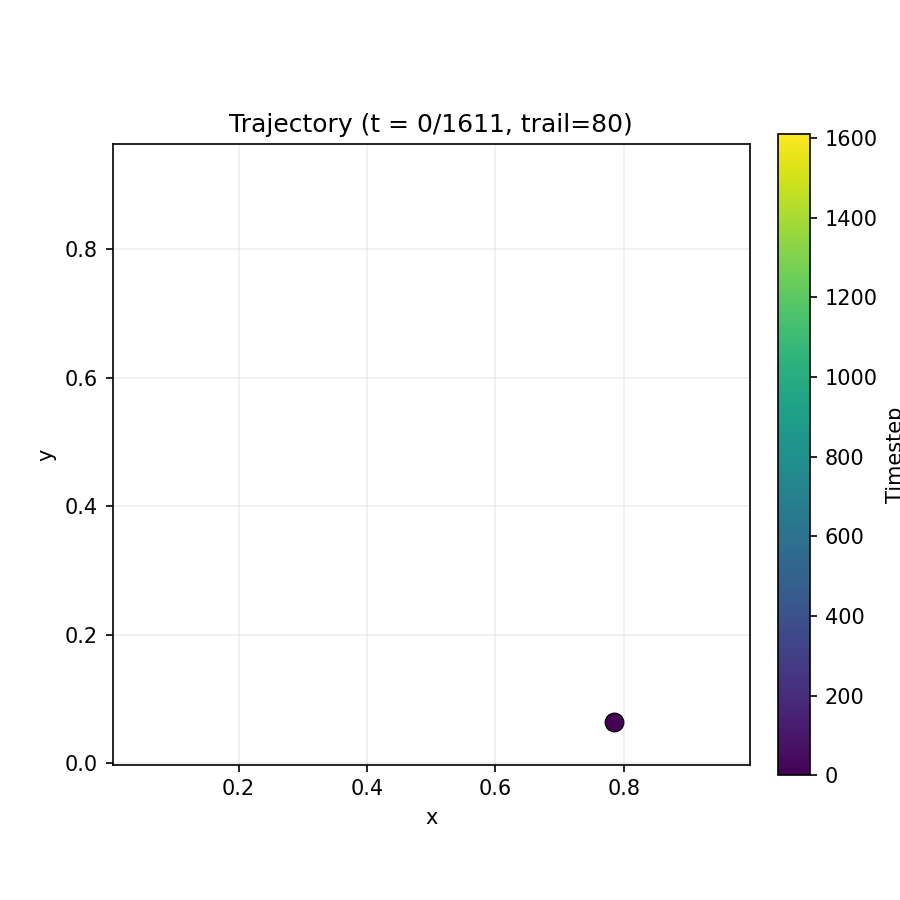

# Mouse maze position decoding from brain signals

This project is a proof of concept for decoding mouse maze position from brain signals. It is a simple model that is trained on a dataset of mouse brain signals and is able to predict the mouse's position in the maze. It was developed as part of the Hackathon [HacktionPotential](https://www.hacktionpotential.fr/) which took place from 27th and 28th of February 2026.

More information about the project can be found in our final presentation [here](assets/presentation.pdf). An article about the project will be available soon on my blog [here](https://www.clementw168.github.io/).

